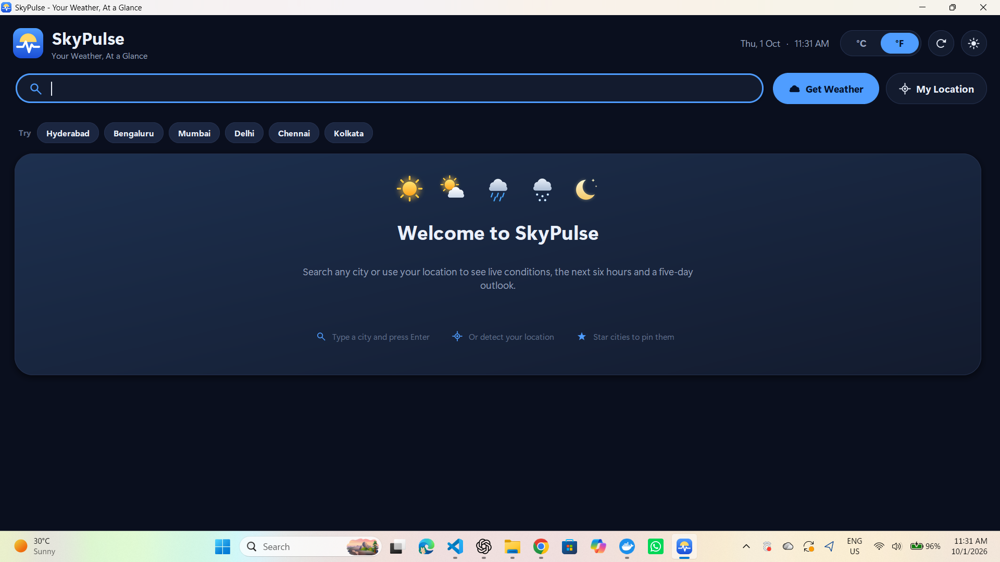
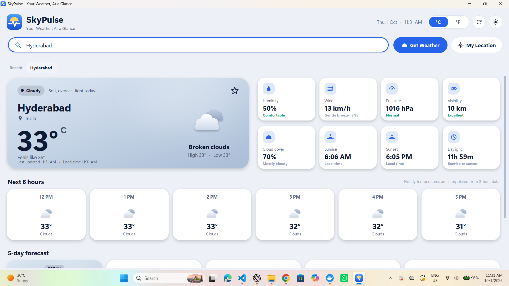
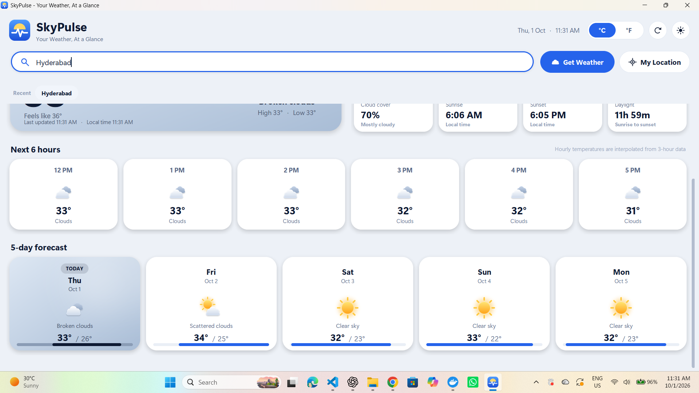
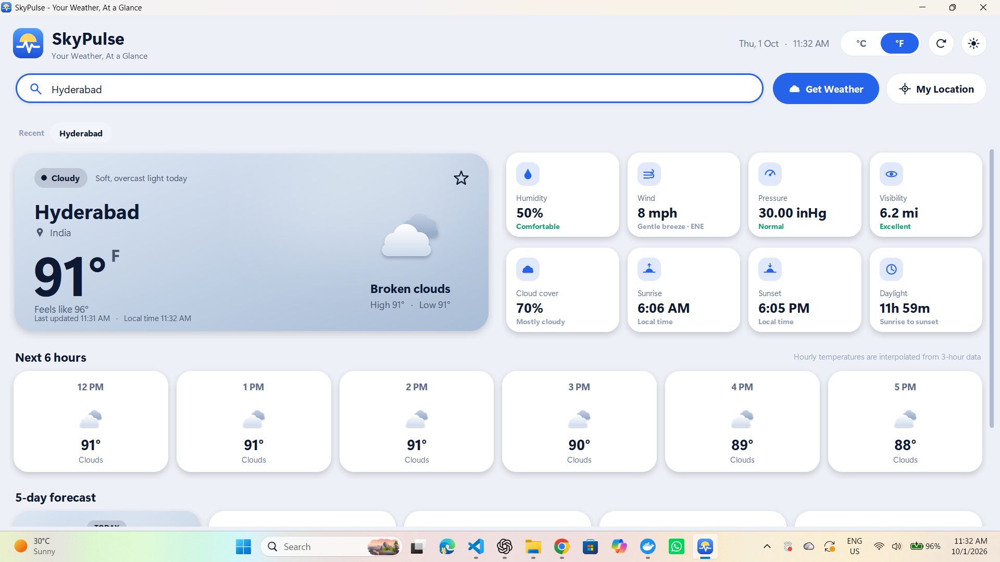
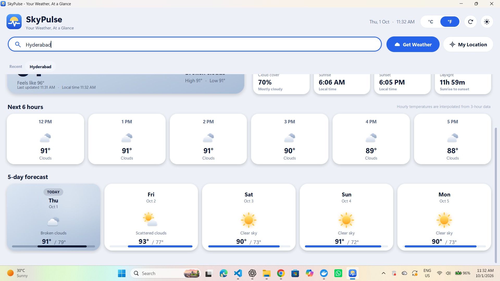

<div align="center">

# 🌤️ SkyPulse – Smart Weather Dashboard

**Real-time weather intelligence in a polished desktop app — built with Python & Tkinter.**


</div>

---

## 1. 📌 Project Overview

SkyPulse is a desktop weather dashboard created for **Task 4 (Basic Weather App)** of the **OASIS INFOBYTE Python Programming Internship**. It fetches live data from the OpenWeatherMap API and presents current conditions, a 6-hour outlook and a 5-day forecast in a modern, responsive interface that adapts its look to the weather and time of day.

The goal was to go beyond a beginner Tkinter form: every card is rendered with anti-aliased rounded corners, soft shadows and weather-aware gradients (using Pillow), while the code stays modular, tested and easy to read.

## 2. ✨ Key Features

| Area | Highlights |
|---|---|
| **Search** | Large rounded search bar, Enter-to-search, inline validation, loading spinner |
| **Current weather** | City, country, temperature, feels-like, condition, high/low, last-updated time |
| **Metrics** | Humidity, wind, pressure, visibility, cloud cover, sunrise, sunset, day length — with status badges |
| **Forecasts** | 6-hour strip and 5-day cards with icons; today's card is highlighted with a range bar for each day |
| **Units** | Instant °C / °F toggle (no extra API call) — wind, visibility and pressure convert too |
| **Themes** | Two purpose-designed themes (dark & light), not just a recolour |
| **Adaptive visuals** | Hero card gradient + decoration changes for clear, cloudy, rain, storm, snow, fog and night |
| **Resilience** | Every failure is shown in a friendly in-app card with hints and a **Retry** button |

## 3. ✅ OASIS INFOBYTE Task 4 Requirements Implemented

| # | Requirement | Status | Where |
|---|---|:---:|---|
| 1 | GUI with city input, **Get Weather** button and clear results area | ✅ | `ui/main_window.py`, `ui/widgets.py` |
| 2 | OpenWeatherMap API integration | ✅ | `weather_service.py` |
| 3 | Current weather information | ✅ | `ui/cards.py` (`HeroCard`, `MetricCard`) |
| 4 | Weather icon for the current condition | ✅ | `ui/icons.py`, `models.icon_name` |
| 5 | Hourly forecast – next 6 hours | ✅ | `forecast.build_hourly`, `HourCard` |
| 6 | Daily forecast – next 5 days | ✅ | `forecast.build_daily`, `DayCard` |
| 7 | Celsius / Fahrenheit toggle | ✅ | `units.Formatter`, `Segmented` |
| 8 | Proper input validation | ✅ | `validators.py` |
| 9 | API errors handled **inside the GUI** | ✅ | `errors.py`, `ErrorCard` |
| 10 | City not found · invalid/expired key · timeout · no internet · empty input | ✅ | see [Error Handling](#13--error-handling) |
| 11 | *Bonus:* automatic location from IP address | ✅ | `location_service.py` |

## 4. 🚀 Extra Features Added

- ⭐ **Favourite cities** (saved locally in `~/.skypulse/preferences.json`)
- 🕘 **Recent searches** (kept for the current session) and clickable suggestion chips
- 🔄 **Refresh** the current city without retyping (`F5` / `Ctrl+R`)
- 📍 **"My Location"** with automatic provider fallback
- 🌦️ **Weather status banner** (Clear, Cloudy, Rainy, Thunderstorm, Snowfall, Low visibility, Clear night)
- 🎨 **Dynamic atmosphere** — rain streaks, snowfall, stars, fog bands and sun glow drawn subtly on the hero card
- 🌗 Theme and unit **preferences remembered** between launches
- 🖥️ **Responsive layout** — metric tiles move below the hero card on narrow windows; the page scrolls if the window is short
- 👋 Polished **welcome**, **loading** and **error** states
- ⌨️ Shortcuts: `Enter` search · `F5`/`Ctrl+R` refresh · `Ctrl+L` focus search · `Ctrl+T` switch theme
- 🖼️ **Offline, generated icon set** — no icon downloads (rendered with Pillow and cached in `assets/weather_icons/`)

## 5. 🧰 Tech Stack

| Purpose | Library |
|---|---|
| GUI | `tkinter` (standard library) |
| HTTP / API | `requests` |
| Icons, gradients, shadows, image handling | `Pillow` |
| Environment variables | `python-dotenv` |
| Data | `json`, `dataclasses`, `datetime` |
| Tests | `unittest` (runs under `pytest` too) |

## 6. 🏗️ Application Architecture

```
Python-Task4-BasicWeatherApp/
├── app.py                 # Entry point (HiDPI setup, logging, launches the window)
├── config.py              # Settings, .env loading, app constants
├── errors.py              # Exception hierarchy — every error has GUI-ready title/message/hints
├── models.py              # Dataclasses + weather classification (condition → kind/icon)
├── units.py               # Unit conversion & display formatting
├── validators.py          # City-input validation
├── weather_service.py     # OpenWeatherMap client, error mapping, JSON parsing
├── forecast.py            # Forecast processing (hourly interpolation, daily grouping)
├── location_service.py    # IP-based location with provider fallback
├── storage.py             # Favourites/theme/unit persistence + session search history
├── theme.py               # Palettes (dark/light), weather atmospheres, ThemeManager
├── ui/
│   ├── main_window.py     # Window, controller, background fetching, dashboard layout
│   ├── widgets.py         # Buttons, search bar, segmented control, chips, scroll area
│   ├── cards.py           # Hero, metric, hourly, daily, welcome/loading/error cards
│   ├── render.py          # Pillow renderers: rounded cards, shadows, gradients, atmospheres
│   ├── icons.py           # Procedural weather icons, UI glyphs, logo
│   └── style.py           # DPI scaling and fonts
├── assets/weather_icons/  # Generated icon PNGs
├── screenshots/           # README images
├── scripts/capture_screenshots.py
├── tests/                 # 69 unit tests (services, parsing, forecast, storage, theme, rendering)
├── .env.example
├── .gitignore
├── requirements.txt / requirements-dev.txt
└── README.md
```

**Data flow**

```
Search / My Location ─▶ validators ─▶ (worker thread) WeatherService ─▶ parse_current + parse_forecast
                                                     └▶ forecast.build_hourly / build_daily
                                                             │
UI thread ◀── result queue ◀── WeatherReport ◀───────────────┘
   └▶ DashboardView renders cards using Formatter (units) and the active Palette
```

Design decisions worth knowing:

- **Non-blocking UI** – network calls run in a worker thread; results return through a queue polled by Tk, and stale results from older requests are ignored.
- **Fetch once, convert locally** – data is requested in metric units; the °C/°F switch only re-formats it.
- **Centralised theming** – widgets read colours from the active `Palette` and re-render on change; no colour literals in widgets.
- **Hourly forecast** – the free OpenWeatherMap forecast has 3-hour steps, so the 6 hourly values are *linearly interpolated* between steps (anchored on the live observation). Icons come from the nearest real step, and day/night follows the city's sunrise/sunset.

## 7. 🔑 API Setup

SkyPulse uses two **free-tier** OpenWeatherMap endpoints:

| Endpoint | Used for |
|---|---|
| `GET /data/2.5/weather` | Current conditions |
| `GET /data/2.5/forecast` | 5-day / 3-hour forecast (feeds hourly + daily views) |

For IP-based location it queries [ipwho.is](https://ipwho.is) and falls back to [ipapi.co](https://ipapi.co) (no key required).

## 8. 🗝️ How to Get an OpenWeatherMap API Key

1. Create a free account at <https://openweathermap.org/api>.
2. Open **My API keys** (<https://home.openweathermap.org/api_keys>) and copy the default key (or generate a new one).
3. **Wait up to ~2 hours** — new keys may return “invalid API key” until they activate.

## 9. ⚙️ Environment Variable Setup

```bash
# macOS / Linux
cp .env.example .env

# Windows (PowerShell)
Copy-Item .env.example .env
```

Then edit `.env`:

```env
OPENWEATHER_API_KEY=paste_your_key_here
```

The key is **never hard-coded**. `.env` is listed in `.gitignore`; only `.env.example` is committed.

## 10. 📦 Installation

```bash
git clone https://github.com/shailajakunchala09/OIBSIP.git
cd OIBSIP/Python-Task4-BasicWeatherApp

python -m venv .venv
# Windows:      .venv\Scripts\activate
# macOS/Linux:  source .venv/bin/activate

pip install -r requirements.txt
```

> **Linux:** Tkinter may need a system package: `sudo apt install python3-tk`.
> **Python:** 3.10 or newer.

## 11. ▶️ How to Run

```bash
python app.py
```

Type a city (e.g. `London`, `Tokyo`, `Paris, FR`) and press **Enter** or click **Get Weather**, or click **My Location**.

## 12. 🖼️ Screenshots

### Weather Dashboard


### Current Weather — Celsius


### Celsius Forecast


### Current Weather — Fahrenheit


### Fahrenheit Forecast


## 13. 🛡️ Error Handling

Every failure is converted to a typed error (`errors.py`) and shown in a card inside the window — the terminal is never the only place a problem appears, and the app never crashes on bad API input.

| Situation | How it is detected | What the user sees |
|---|---|---|
| Empty / invalid city | `validators.validate_city` (before any request) | Inline message under the search bar, field turns red |
| City not found | HTTP 404 / 400 | “City not found” card with spelling tips |
| Invalid or expired API key | HTTP 401 | “Invalid or expired API key” card with activation advice |
| Missing API key | Key absent or placeholder | Setup steps; welcome screen also shows a warning |
| Network timeout | `requests.exceptions.Timeout` | “The request timed out” + Retry |
| No internet | `requests.exceptions.ConnectionError` | “No internet connection” + Retry |
| Rate limit (429) / server error (5xx) | HTTP status | Friendly explanation + Retry |
| Malformed JSON / unexpected shape | Parsing guards | “Unexpected weather data” + Retry |
| Location lookup fails | Provider fallback, then `LocationError` | Message suggesting a manual search |
| Any unexpected exception | Worker catch-all + Tk callback hook | Generic error card, details logged only |

## 14. 🧪 Testing

```bash
python -m unittest discover -v      # standard library only
# or
pip install -r requirements-dev.txt && pytest
```

The suite (69 tests) covers: empty/invalid input validation · JSON parsing (full, partial and malformed payloads) · temperature/wind/distance/pressure conversion and rounding · hourly interpolation and daily grouping · HTTP-status and network-failure mapping · API key never leaking into error text · location providers, fallback and garbage responses · preferences persistence and corruption recovery · theme system and atmosphere contrast · Pillow renderers and icons. The tests use fake HTTP sessions, so they run offline.

## 15. 🔒 Security Notes

- The API key comes from `OPENWEATHER_API_KEY` (environment or `.env`) — never from source code.
- `.env` is git-ignored. If a key is ever committed by mistake, **revoke it** in your OpenWeatherMap account.
- Exception text from `requests` is never displayed or logged, because it can contain the request URL (and key). A test enforces this.
- User input is validated and passed as a query parameter (not concatenated into URLs).
- IP-based location is approximate and sends only your public IP to the location provider; it runs only when you click **My Location**.
- Preferences are stored in your home folder (`~/.skypulse/`), outside the repository.

## 16. 🔭 Future Enhancements

- True hourly data via OpenWeatherMap One Call (paid tier) instead of interpolation
- Air-quality index, UV index and weather alerts
- City autocomplete using the Geocoding API
- Weather maps and temperature trend charts
- Packaged installer (PyInstaller) and system-tray notifications
- Localisation (languages and 24-hour time)

## 17. 🎓 Credits / Internship Information

- **Author:** Kunchala Shailaja — [@shailajakunchala09](https://github.com/shailajakunchala09)
- **Internship:** Python Programming Internship, **OASIS INFOBYTE** (Task 4 – Basic Weather App)
- **Repository:** [OIBSIP](https://github.com/shailajakunchala09/OIBSIP)
- Weather data © [OpenWeatherMap](https://openweathermap.org/) · IP geolocation by [ipwho.is](https://ipwho.is) / [ipapi.co](https://ipapi.co)
- Icons, logo and UI artwork are generated in code with Pillow.
