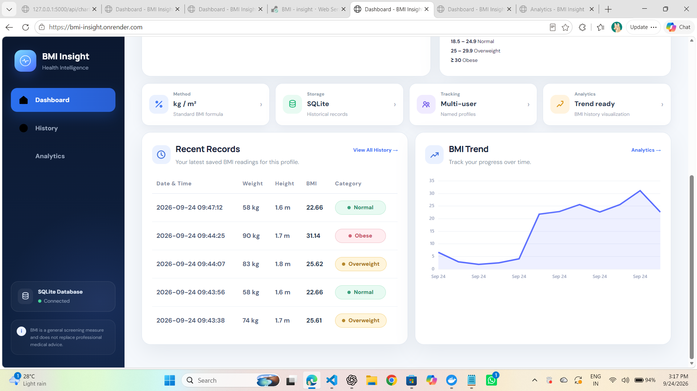
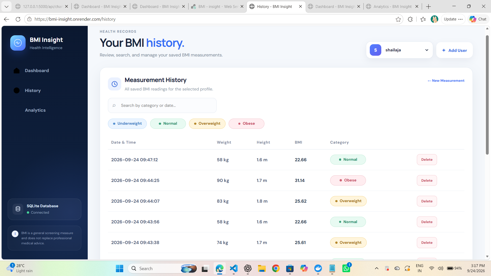
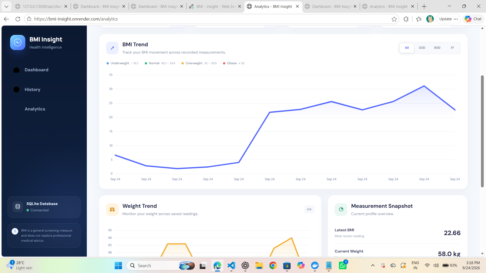
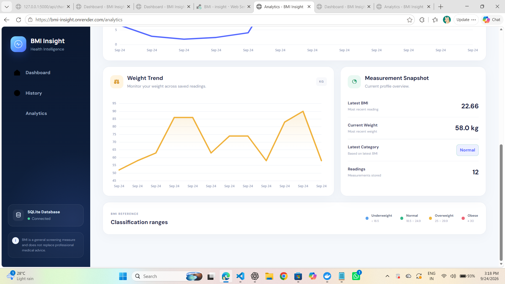
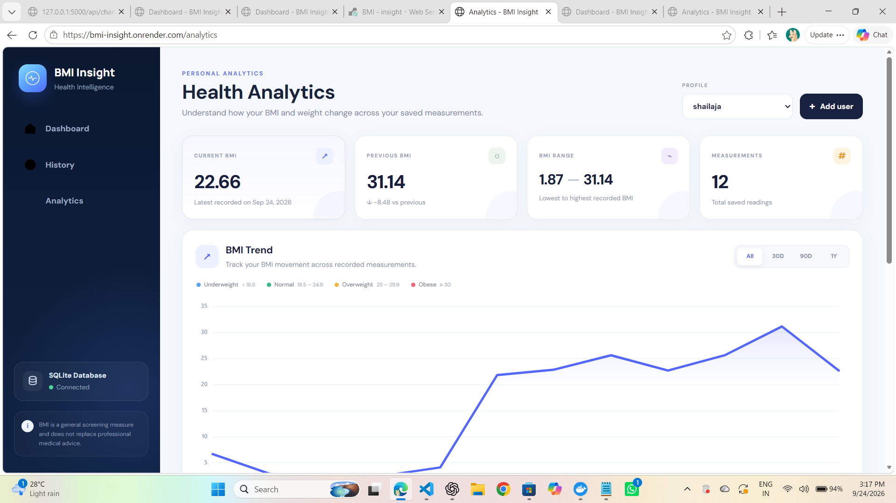

# 🧮 BMI Insight

  <strong>Personal BMI Tracking & Health Analytics</strong>
   

  A Python-based BMI calculator and personal health analytics application
  with multi-user support, persistent SQLite storage, historical tracking,
  and BMI trend visualization through both web and desktop interfaces.

  
  
  
  
  
  
  
  

---

### LIVE DEMO:
https://bmi-insight.onrender.com/

---

## About

BMI Insight is a Python-based application designed to provide a simple, organized, and persistent way to calculate and track Body Mass Index (BMI).

Instead of calculating a BMI value once and losing the result, users can create named profiles, record multiple measurements, view their previous records, and analyze BMI and weight changes over time.

The project provides both a **Flask web application** and a **Tkinter desktop application**, using shared calculation, validation, and SQLite database logic.

The application is developed as part of the **OASIS INFOBYTE Python Programming Internship — Task 2 (Advanced Tier)**.

---

## Why This Project?

A basic BMI calculator performs a calculation and displays a result.

BMI Insight extends this concept into a small personal tracking and analytics system by adding persistent storage, multiple user profiles, historical records, and trend visualization.

### Advantages

- Simple and clear BMI calculation
- Separate records for multiple users
- Persistent history using SQLite
- BMI and weight trend visualization
- Web and desktop interfaces
- Input validation and error handling
- Modular and reusable Python code
- Automated testing for core functionality

---

## Key Features

| Feature | Description |
|---|---|
| ⚖️ BMI Calculator | Calculates BMI from weight and height |
| 📊 BMI Classification | Classifies BMI into standard health categories |
| 👤 Multi-User Support | Allows separate named user profiles |
| 💾 SQLite Storage | Stores BMI records persistently |
| 📋 History | Displays previous BMI measurements |
| 🔎 Search & Filter | Filters historical records in the web application |
| 🗑️ Delete Records | Removes individual historical measurements |
| 📈 BMI Trend | Visualizes BMI measurements over time |
| ⚖️ Weight Trend | Visualizes weight changes over time |
| 📊 Analytics | Displays BMI summary statistics |
| 🎨 Color-Coded Result | Provides visual category feedback |
| 📏 BMI Scale | Shows the result on a visual BMI scale |
| 🌐 Web Application | Flask-based responsive web dashboard |
| 🖥️ Desktop Application | Tkinter-based graphical application |
| 🌗 Theme Support | Light and dark theme support in desktop application |
| 🔔 Notifications | User feedback and delete confirmations |
| ⚠️ Error Handling | Handles invalid input and database errors |
| 🧪 Automated Testing | Core logic tested using pytest |

---

### Technology Stack

## Backend

Python 3  
Flask  
SQLite  
sqlite3  

## Desktop GUI

Tkinter  
Matplotlib  

## Frontend

HTML5  
CSS3  
JavaScript  
Chart.js  

## Testing

pytest  

## Deployment

Gunicorn  
Git  
GitHub  

## Development

Python Virtual Environment  
JSON  
Environment Variables  

---

## BMI Calculation

BMI is calculated using the standard formula:
BMI = Weight / Height²
Weight = kilograms
Height = meters

## BMI Categories
| BMI Range      | Category    |
| -------------- | ----------- |
| Below 18.5     | Underweight |
| 18.5 – 24.9    | Normal      |
| 25.0 – 29.9    | Overweight  |
| 30.0 and above | Obese       |

## How the Application Works
The application follows a simple workflow:

Select or Create User
        ↓
Enter Weight & Height
        ↓
Validate Input
        ↓
Calculate BMI
        ↓
Determine BMI Category
        ↓
Save Measurement to SQLite
        ↓
View History
        ↓
Analyze BMI & Weight Trends

## Web Application

The Flask web application provides a modern dashboard interface.

### Dashboard

The dashboard provides:

User profile selection
Add-user functionality
Weight and height inputs
BMI calculation
Color-coded result
BMI scale
Summary metrics
Recent records
BMI trend visualization
History

### The History page provides:

Complete BMI history
Measurement date and time
Weight
Height
BMI
Category
Search and filtering
Record deletion
Analytics

### The Analytics page provides:

Latest BMI
Previous BMI
Highest BMI
Lowest BMI
Total measurement count
BMI trend chart
Weight trend chart

## Desktop Application

The desktop version is built using Tkinter and provides the same core functionality through a standalone graphical interface.

### Dashboard
User selection
Add-user functionality
Weight and height input
BMI calculation
BMI result card
Color-coded category
BMI scale
Reset functionality

### History
Complete measurement history
Date and time
Weight
Height
BMI
Category
Record deletion

### Analytics
BMI statistics
BMI trend chart
Weight trend chart
Matplotlib visualization

The desktop application also supports light and dark themes.

## 📸 Screenshots

### 🏠 Dashboard

  

### ✅ Normal BMI Result

  

### 🟠 Overweight BMI Result

  

### 🔴 Obese BMI Result

  

### 📋 BMI History

  

### 📈 BMI Analytics

  

## Project Structure

Python-Task2-BMICalculator/

│

├── app.py

├── desktop_app.py

├── bmi_calculator.py

├── database.py

├── validators.py

├── config.py

├── requirements.txt

├── README.md

├── .gitignore

│

├── templates/

│   ├── base.html

│   ├── index.html

│   ├── history.html

│   └── analytics.html

│

├── static/

│   ├── css/

│   │   └── style.css

│   ├── js/

│   │   └── app.js

│   │

│   └── assets/

│

├── data/

│

├── screenshots/

│

└── tests/

    └── test_bmi.py

## Future Enhancements
Additional health metrics
Advanced analytics and reporting
PostgreSQL database support
User authentication
Exportable analytics charts
Additional visualization options
Additional measurement units
Cloud data synchronization
Progressive Web App support

## Learning Outcomes

This project provided practical experience with:

Python application development
Modular programming
BMI calculation and classification
Input validation
SQLite database design
CRUD operations
Flask web development
Tkinter GUI development
Matplotlib visualization
Chart.js visualization
Automated testing with pytest
Database error handling
Git and GitHub
Web application deployment

## Project Status

Completed — Oasis Infobyte Internship (OIBSIP), Python Programming Task 2

### Implemented
BMI calculation
BMI classification
Multi-user profiles
SQLite persistence
Historical BMI records
Search and filtering
Record deletion
BMI analytics
BMI trend visualization
Weight trend visualization
Flask web application
Tkinter desktop application
Responsive web interface
Input validation
Database error handling
Automated testing
Deployment configuration

## Developer
### Kunchala Shailaja

BCA Graduate | Python Programming | AI/ML Learner

## GitHub:
https://github.com/shailajakunchala09

## Repository:
https://github.com/shailajakunchala09/OIBSIP
