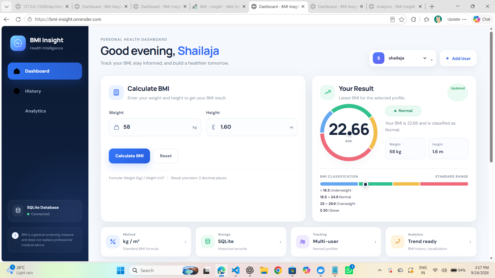

# BMI Insight

A modern BMI Calculator and Personal Health Analytics application developed for the **OASIS INFOBYTE Python Programming Internship — Task 2 (Advanced Tier)**.

BMI Insight provides BMI calculation, category classification, multi-user support, persistent historical records, analytics, and trend visualization through both a **Flask web application** and a **Tkinter desktop application**.

---

## Overview

BMI Insight is designed as more than a one-time BMI calculator.

The application allows users to:

- Calculate Body Mass Index (BMI)
- Classify BMI into standard categories
- Maintain separate profiles for multiple users
- Store measurements persistently in SQLite
- Review historical BMI records
- View BMI and weight trends over time
- Monitor summary statistics
- Delete individual records
- Use the application through either a web interface or desktop GUI

The project follows a modular architecture where BMI calculation, validation, database operations, and interface logic are maintained separately.

---

## OASIS INFOBYTE Internship

**Organization:** OASIS INFOBYTE  
**Track:** Python Programming  
**Task:** Python Programming Task 2 — BMI Calculator  
**Level:** Advanced Tier

This project implements the Advanced Tier requirements using Python, Tkinter, Flask, SQLite, Matplotlib, and Chart.js.

---

# Features

## BMI Calculation

- Weight input in kilograms
- Height input in meters
- BMI calculated using:

```text
BMI = Weight / Height²
```

- BMI displayed to 2 decimal places
- Automatic BMI classification
- Color-coded category feedback
- Visual BMI scale with result indicator

### BMI Categories

| BMI Range | Category |
|---|---|
| Below 18.5 | Underweight |
| 18.5 – 24.9 | Normal |
| 25.0 – 29.9 | Overweight |
| 30.0 and above | Obese |

---

## Multi-User Support

The application supports multiple named users.

Each user has an independent BMI history.

Users can:

- Create a profile
- Select an existing profile
- Calculate BMI for the selected profile
- View personal historical measurements
- Analyze personal BMI trends

---

## Persistent History

Every successful BMI calculation can be stored as a historical record containing:

- User
- Weight
- Height
- BMI
- BMI category
- Date and time

Records are stored in SQLite so that historical measurements remain available between application sessions.

---

## Analytics & Trend Visualization

BMI Insight provides:

- Latest BMI
- Previous BMI
- Highest BMI
- Lowest BMI
- Total measurement count
- BMI trend over time
- Weight trend over time

### Charts

**Desktop application:** Matplotlib  
**Web application:** Chart.js

---

## History Management

The application provides:

- Complete measurement history
- Search/filter functionality
- Record deletion
- Date and time information
- Weight and height values
- BMI values
- BMI category information

The web application also supports historical data export.

---

## Input Validation

The application validates user input before performing calculations.

Validation handles:

- Empty fields
- Non-numeric values
- Zero values
- Negative values
- Invalid weight ranges
- Invalid height ranges

Examples:

```text
Weight can't be empty
Weight must be a number
Weight must be greater than zero
Height must be greater than zero
Weight should be within the allowed range
Height should be within the allowed range
```

Invalid input is handled gracefully without crashing the application.

---

## Error Handling

Database operations are handled through a dedicated database layer.

The application handles:

- Database connection errors
- Database read failures
- Database write failures
- Record insertion failures
- Record deletion failures

Errors are converted into readable application-level messages instead of exposing raw SQLite exceptions to the user.

---

# Application Interfaces

BMI Insight includes two interfaces built on the same core business logic.

---

## 1. Web Application

The Flask web application provides a modern responsive dashboard.

### Dashboard

The dashboard includes:

- User selection
- Add-user functionality
- Weight input
- Height input
- BMI calculation
- Color-coded BMI result
- BMI scale
- Summary metrics
- Recent records
- BMI trend visualization

### History

The history page provides:

- Complete BMI measurement history
- Search/filter functionality
- BMI category badges
- Record deletion
- Historical data export

### Analytics

The analytics page provides:

- Latest BMI
- Previous BMI
- Highest BMI
- Lowest BMI
- Total number of measurements
- BMI trend chart
- Weight trend chart

---

## 2. Desktop Application

The desktop application is built with Tkinter.

### Dashboard

Includes:

- User selection
- Add-user functionality
- Weight input
- Height input
- Calculate button
- Reset button
- BMI result display
- Color-coded category
- BMI scale visualization

### History

Includes:

- Complete record table
- Date and time
- Weight
- Height
- BMI
- Category
- Record deletion

### Analytics

Includes:

- BMI summary statistics
- BMI trend chart
- Weight trend chart
- Matplotlib visualization

The desktop application also supports light and dark themes.

---

# Technology Stack

| Technology | Purpose |
|---|---|
| Python 3 | Core programming language |
| Flask | Web application and API |
| Tkinter | Desktop GUI |
| SQLite | Persistent data storage |
| Matplotlib | Desktop data visualization |
| Chart.js | Web data visualization |
| HTML5 | Web structure |
| CSS3 | Web styling |
| JavaScript | Frontend interaction |
| pytest | Automated testing |
| Gunicorn | Production web server |

---

# Project Architecture

```text
                    BMI Insight
                        │
          ┌─────────────┴─────────────┐
          │                           │
          ▼                           ▼
   Flask Web App               Tkinter Desktop App
          │                           │
          └─────────────┬─────────────┘
                        │
                        ▼
              Shared Application Logic
                        │
             ┌──────────┴──────────┐
             │                     │
             ▼                     ▼
       BMI Calculation        Validation
             │                     │
             └──────────┬──────────┘
                        │
                        ▼
                SQLite Database
                        │
              ┌─────────┴─────────┐
              │                   │
              ▼                   ▼
           History            Analytics
```

The calculation and validation modules are shared by both interfaces to keep the application behavior consistent.

---

# Database Design

BMI Insight uses SQLite for persistent storage.

## Users Table

### `users`

| Column | Type | Description |
|---|---|---|
| `id` | INTEGER | Primary key |
| `name` | TEXT | Unique user name |
| `created_at` | TEXT | Creation timestamp |

## BMI Records Table

### `bmi_records`

| Column | Type | Description |
|---|---|---|
| `id` | INTEGER | Primary key |
| `user_id` | INTEGER | Foreign key referencing `users.id` |
| `weight` | REAL | Weight in kilograms |
| `height` | REAL | Height in meters |
| `bmi` | REAL | Calculated BMI |
| `category` | TEXT | BMI classification |
| `created_at` | TEXT | Measurement timestamp |

### Relationship

```text
users
  │
  │ user_id
  ▼
bmi_records
```

Each BMI record belongs to a specific user.

---

# Project Structure

```text
Python-Task2-BMICalculator/
│
├── app.py
├── desktop_app.py
├── bmi_calculator.py
├── database.py
├── validators.py
├── config.py
├── requirements.txt
├── README.md
├── .gitignore
│
├── templates/
│   ├── base.html
│   ├── index.html
│   ├── history.html
│   └── analytics.html
│
├── static/
│   ├── css/
│   │   └── style.css
│   ├── js/
│   │   └── app.js
│   └── assets/
│
├── data/
│
├── screenshots/
│
└── tests/
    └── test_bmi.py
```

---

# Core Modules

## `bmi_calculator.py`

Contains the core BMI functionality:

- BMI calculation
- BMI classification
- BMI category positioning

## `validators.py`

Handles:

- Weight validation
- Height validation
- User name validation
- Numeric input validation
- Range validation

## `database.py`

Responsible for:

- SQLite initialization
- User creation
- User retrieval
- BMI record insertion
- BMI history retrieval
- Statistics
- Record deletion
- Database error handling

## `config.py`

Contains:

- BMI thresholds
- Validation ranges
- Database path
- Application settings
- Environment-based configuration

## `app.py`

Contains the Flask web application and API endpoints for:

- Dashboard
- History
- Analytics
- User management
- BMI calculation
- Records
- Statistics
- Chart data
- Health check

## `desktop_app.py`

Contains the Tkinter desktop application with:

- Dashboard
- History
- Analytics
- User management
- Matplotlib charts
- Theme support

---

# Screenshots

Add the final screenshots of the completed application to the `screenshots/` folder.

Recommended files:

```text
screenshots/
├── 01-dashboard.png
├── 02-bmi-result.png
├── 03-history.png
├── 04-analytics.png
└── 05-mobile-view.png
```

### Dashboard



### BMI Result


### History


### Analytics


### Mobile View


---

# Installation

## 1. Clone the Repository

```bash
git clone https://github.com/shailajakunchala09/OIBSIP.git
```

## 2. Navigate to the Project

```bash
cd OIBSIP/Python-Task2-BMICalculator
```

## 3. Create a Virtual Environment

### Windows

```bash
python -m venv venv
venv\Scripts\activate
```

### macOS / Linux

```bash
python3 -m venv venv
source venv/bin/activate
```

## 4. Install Dependencies

```bash
pip install -r requirements.txt
```

---

# Running the Web Application

Start the Flask application:

```bash
python app.py
```

Open the application in your browser:

```text
http://localhost:5000
```

---

# Running the Desktop Application

Start the Tkinter application:

```bash
python desktop_app.py
```

The SQLite database is created automatically when required.

---

# Running Tests

Run the automated test suite:

```bash
python -m pytest tests/test_bmi.py -v
```

The tests cover:

- BMI calculation
- BMI classification
- BMI category boundaries
- Decimal inputs
- Empty input
- Non-numeric input
- Negative values
- Zero values
- Invalid ranges

---

# Example

```python
from bmi_calculator import calculate_bmi, categorize_bmi

bmi = calculate_bmi(70, 1.75)
category = categorize_bmi(bmi)

print(bmi)
print(category)
```

Output:

```text
22.86
Normal
```

---

# Security & Privacy

The project follows basic application security practices:

- Parameterized SQLite queries
- No hardcoded passwords
- No hardcoded production secrets
- Flask secret configuration through environment variables
- Debug mode disabled by default
- Database files excluded from Git
- No `eval()` usage
- No shell command execution
- Input validation before processing

The application is designed as a BMI calculation and tracking tool and is not a medical diagnostic system.

---

# BMI Disclaimer

> **BMI is a general screening measure and does not replace professional medical advice.**

BMI is a simple screening indicator and should not be considered a complete assessment of an individual's health.

---

# Deployment

The Flask application can be deployed using Gunicorn.

Example:

```bash
gunicorn app:app
```

### Example Deployment Configuration

```text
Build Command:
pip install -r requirements.txt

Start Command:
gunicorn app:app
```

The application can be hosted on a Python-compatible cloud platform such as Render.

### SQLite Deployment Note

SQLite is used for this internship project because it provides simple persistent local storage without requiring an external database service.

On hosting environments with ephemeral storage, SQLite data may not survive instance replacement or redeployment.

For a production-scale deployment, a managed database such as PostgreSQL would be more appropriate.

---

# Design Principles

## Separation of Concerns

Calculation, validation, database access, and user interface logic are maintained in separate modules.

## Reusable Core Logic

The same BMI calculation and validation modules are shared by both application interfaces.

## Persistent Storage

BMI measurements are stored in SQLite instead of being limited to temporary application memory.

## User-Centered Interface

The web dashboard and desktop application provide clear visual feedback and organized access to historical data.

## Graceful Error Handling

Invalid input and database failures are handled with readable messages rather than application crashes.

---

# Future Improvements

Possible future enhancements include:

- Additional health metrics
- Advanced analytics
- Exportable charts
- Improved user authentication
- Cloud database support
- Additional measurement units
- Extended reports
- More visualization options
- Progressive Web App support

---

# Learning Outcomes

This project provided practical experience in:

- Python application development
- Modular programming
- BMI calculation and classification
- Input validation
- SQLite database design
- CRUD operations
- Flask web development
- API development
- Tkinter GUI development
- Matplotlib visualization
- Chart.js integration
- Automated testing
- Error handling
- Git and GitHub
- Application deployment

---

# Repository

**GitHub Repository:**

https://github.com/shailajakunchala09/OIBSIP

**Project Directory:**

```text
OIBSIP/Python-Task2-BMICalculator/
```

---

# Author

**Kunchala Shailaja**

Python Programming Intern  
OASIS INFOBYTE

---

# Project Status

**Completed — OASIS INFOBYTE Python Programming Internship Task 2**

The project includes:

- BMI calculation
- BMI classification
- Multi-user support
- SQLite persistence
- Historical records
- Search and filtering
- Analytics
- BMI trend visualization
- Weight trend visualization
- Flask web application
- Tkinter desktop application
- Input validation
- Error handling
- Automated testing
