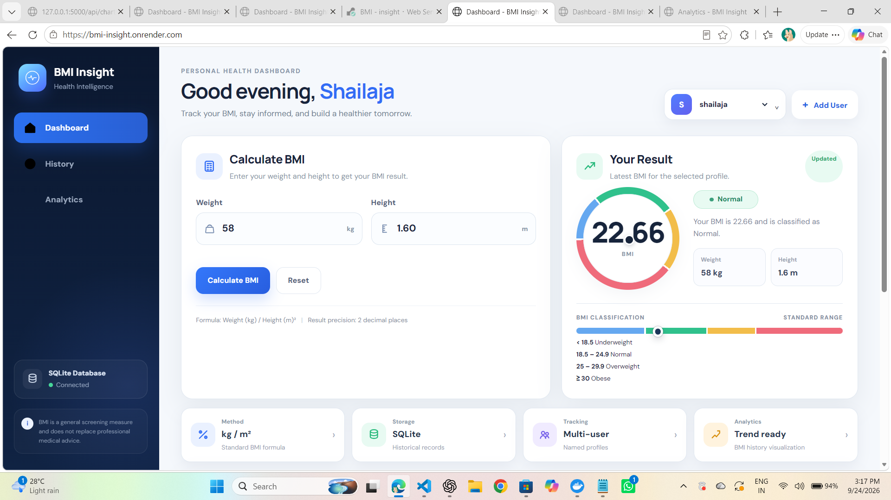
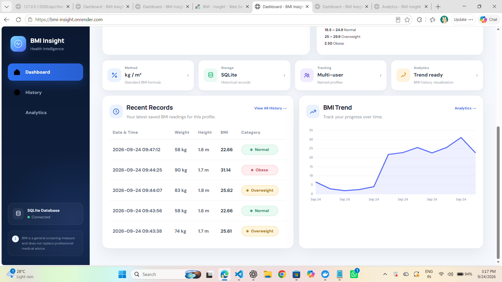
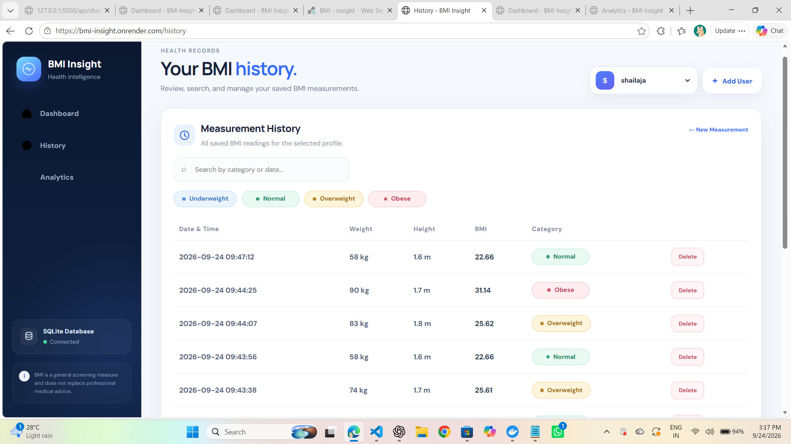
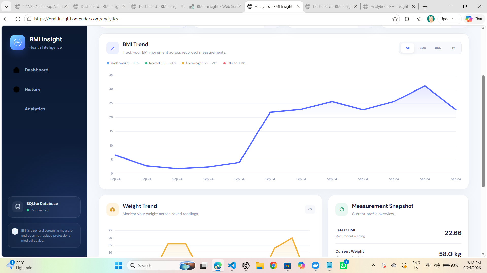
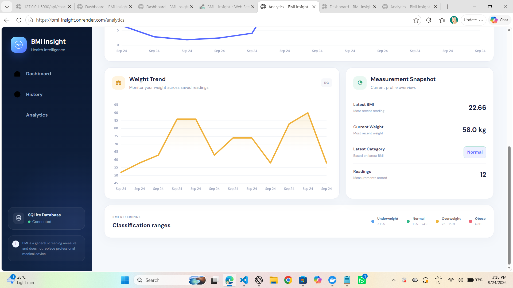
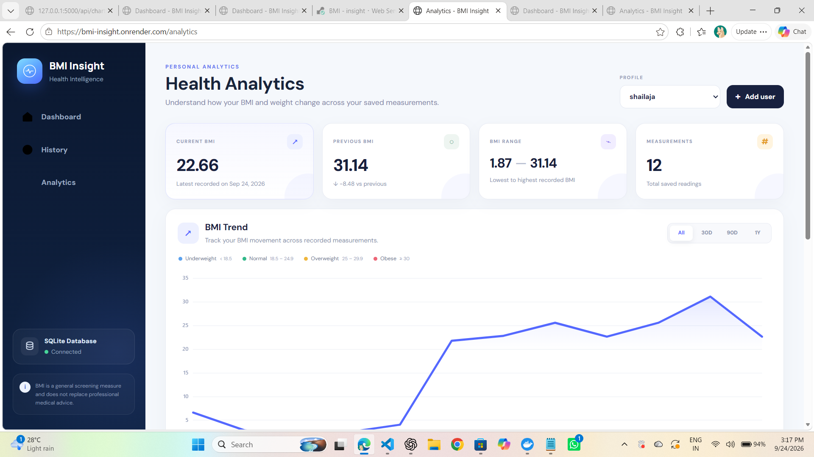

# 🧮 BMI Insight

<p align="center">
  <b>Personal BMI Tracking &amp; Health Analytics</b><br/>
  <i>Calculate, track, and analyze BMI measurements through web and desktop interfaces.</i>
</p>

<p align="center">
  
  
  
  
  
  
  
  
  
  
</p>

---

## 🌐 Live Demo

**https://bmi-insight.onrender.com/**

---

## 📖 Project Overview

**BMI Insight** is a Python-based BMI calculator and personal health analytics application developed for the **OASIS INFOBYTE Python Programming Internship — Task 2**.

The application allows users to calculate BMI, create multiple user profiles, store measurements using SQLite, view historical records, and analyze BMI and weight trends.

The project provides both a **Flask web application** and a **Tkinter desktop application**, supported by shared calculation, validation, database, and analytics functionality.

---

## 🎯 Why This Project?

A basic BMI calculator provides a single BMI result without preserving previous measurements.

BMI Insight extends the basic calculation into a personal tracking and analytics system by providing:

- Persistent BMI history
- Multiple user profiles
- BMI and weight trend visualization
- Search and filtering
- Record management
- Web and desktop interfaces
- Input validation and error handling

  ---

## ✨ Key Features

| Feature | Description |
|---|---|
| ⚖️ **BMI Calculator** | Calculates BMI from weight and height |
| 📊 **BMI Classification** | Classifies BMI into standard health categories |
| 👤 **Multi-User Support** | Allows separate named user profiles |
| 💾 **SQLite Storage** | Stores BMI records persistently |
| 📋 **History** | Displays previous BMI measurements |
| 🔎 **Search & Filter** | Filters historical records |
| 🗑️ **Delete Records** | Removes individual historical measurements |
| 📈 **BMI Trend** | Visualizes BMI measurements over time |
| ⚖️ **Weight Trend** | Visualizes weight changes over time |
| 📊 **Analytics** | Displays BMI summary statistics |
| 🎨 **Color-Coded Results** | Provides visual BMI category feedback |
| 📏 **BMI Scale** | Shows results on a visual BMI scale |
| 🌐 **Web Application** | Flask-based responsive web dashboard |
| 🖥️ **Desktop Application** | Tkinter-based graphical application |
| 🌗 **Theme Support** | Light and dark theme support |
| ⚠️ **Error Handling** | Handles invalid input and database errors |
| 🧪 **Automated Testing** | Tests core BMI functionality using pytest |

---

---

## 🧰 Technology Stack

| Layer | Technology |
|---|---|
| Language | Python 3 |
| Web Backend | Flask |
| Desktop GUI | Tkinter |
| Database | SQLite |
| Web Frontend | HTML5, CSS3, JavaScript |
| Web Charts | Chart.js |
| Desktop Charts | Matplotlib |
| Testing | pytest |
| Configuration | JSON, Environment Variables |
| Deployment | Gunicorn, Render |
| Development | Git, GitHub, Python Virtual Environment |

---
---

## 🧮 BMI Calculation

BMI is calculated using the standard formula:

**BMI = Weight (kg) / Height (m)²**

Where:

- **Weight** is measured in kilograms
- **Height** is measured in meters

### BMI Categories

| BMI Range | Category |
|---|---|
| Below 18.5 | Underweight |
| 18.5 – 24.9 | Normal |
| 25.0 – 29.9 | Overweight |
| 30.0 and above | Obese |

---
---

## 🔄 Application Workflow

The application follows a simple workflow:

```text
Select or Create User
        │
        ▼
Enter Weight & Height
        │
        ▼
Validate Input
        │
        ▼
Calculate BMI
        │
        ▼
Determine BMI Category
        │
        ▼
Save Measurement to SQLite
        │
        ▼
View History
        │
        ▼
Analyze BMI & Weight Trends
```

---
---

## 🌐 Web Application

The Flask web application provides a modern dashboard for calculating and tracking BMI.

### 🏠 Dashboard

The dashboard provides:

- User profile selection
- Add-user functionality
- Weight and height inputs
- BMI calculation
- Color-coded BMI result
- BMI scale
- Summary metrics
- Recent records
- BMI trend visualization

### 📋 History

The History page provides:

- Complete BMI history
- Measurement date and time
- Weight
- Height
- BMI
- Category
- Search and filtering
- Record deletion

### 📊 Analytics

The Analytics page provides:

- Latest BMI
- Previous BMI
- Highest BMI
- Lowest BMI
- Total measurement count
- BMI trend chart
- Weight trend chart

---
---

## 🖥️ Desktop Application

The desktop version is built using **Tkinter** and provides the same core BMI tracking functionality through a standalone graphical interface.

### 🏠 Dashboard

- User selection
- Add-user functionality
- Weight and height input
- BMI calculation
- BMI result card
- Color-coded BMI category
- BMI scale
- Reset functionality

### 📋 History

- Complete measurement history
- Date and time
- Weight
- Height
- BMI
- Category
- Record deletion

### 📊 Analytics

- BMI statistics
- BMI trend chart
- Weight trend chart
- Matplotlib visualization

The desktop application also supports **light and dark themes**.

---
---

## 📸 Screenshots

### 🏠 Dashboard

<p align="center">
  
</p>

### ✅ Normal BMI Result

<p align="center">
  
</p>

### 🟠 Overweight BMI Result

<p align="center">
  
</p>

### 🔴 Obese BMI Result

<p align="center">
  
</p>

### 📋 BMI History

<p align="center">
  
</p>

### 📈 BMI Analytics

<p align="center">
  
</p>

---
---

## 📁 Project Structure

```text
Python-Task2-BMICalculator/
│
├── app.py
├── desktop_app.py
├── bmi_calculator.py
├── database.py
├── validators.py
├── config.py
├── requirements.txt
├── README.md
├── .gitignore
│
├── templates/
│   ├── base.html
│   ├── index.html
│   ├── history.html
│   └── analytics.html
│
├── static/
│   ├── css/
│   │   └── style.css
│   ├── js/
│   │   └── app.js
│   └── assets/
│
├── data/
│
├── screenshots/
│   ├── 01-dashboard.png
│   ├── 02-normal-result.png
│   ├── 03-overweight-result.png
│   ├── 04-obese-result.png
│   ├── 05-history.png
│   └── 06-analytics-bmi-trend.png
│
└── tests/
    └── test_bmi.py
```

---
---

## 📄 File Overview

| File / Folder | Purpose |
|---|---|
| `app.py` | Flask web application entry point |
| `desktop_app.py` | Tkinter desktop application |
| `bmi_calculator.py` | BMI calculation and classification logic |
| `database.py` | SQLite database operations and record management |
| `validators.py` | Input validation and error checking |
| `config.py` | Application configuration |
| `requirements.txt` | Python dependencies |
| `templates/` | Flask HTML templates |
| `static/` | CSS, JavaScript, and frontend assets |
| `data/` | Application data and SQLite storage |
| `screenshots/` | Project screenshots |
| `tests/` | Automated test files |

---
---

## 🛡️ Validation & Error Handling

BMI Insight includes input validation and error handling to provide reliable application behavior.

### Input Validation

- Checks that weight and height values are provided
- Prevents invalid or non-numeric input
- Validates positive measurement values
- Prevents invalid BMI calculations

### Database Error Handling

- Handles SQLite database errors
- Provides appropriate feedback when database operations fail
- Maintains reliable record creation, retrieval, and deletion

### User Feedback

The application provides clear feedback for:

- Invalid input
- Missing values
- Calculation errors
- Database operation errors

---
---

## 🧪 Testing

The project includes automated tests using **pytest** to verify the core BMI functionality.

Testing covers:

- BMI calculation
- BMI category classification
- Valid input handling
- Invalid input handling
- Boundary BMI values
- Core application logic

Run the tests with:

```bash
pytest
```

---
---

## 🚀 Installation & How to Run

### 1. Clone the Repository

```bash
git clone https://github.com/shailajakunchala09/OIBSIP.git
cd OIBSIP
```

Navigate to the BMI Insight project directory.

### 2. Create a Virtual Environment

```bash
python -m venv venv
```

Activate the virtual environment.

**Windows:**

```bash
venv\Scripts\activate
```

**Linux / macOS:**

```bash
source venv/bin/activate
```

### 3. Install Dependencies

```bash
pip install -r requirements.txt
```

### 4. Run the Web Application

```bash
python app.py
```

Open the local Flask URL shown in the terminal.

### 5. Run the Desktop Application

```bash
python desktop_app.py
```

### 6. Run Tests

```bash
pytest
```

---
---

## 💡 Usage

1. Select an existing user or create a new user profile.
2. Enter the user's weight and height.
3. Calculate the BMI.
4. View the BMI value and category.
5. Save the measurement to the database.
6. Open **History** to review previous measurements.
7. Use **Search & Filter** to find specific records.
8. Open **Analytics** to view BMI and weight trends.
9. Delete individual records when required.
10. Switch between light and dark themes in the desktop application.

---
---

## 🔮 Future Enhancements

- Add additional health and wellness metrics
- Introduce advanced analytics and reporting
- Support PostgreSQL for larger-scale deployments
- Add secure user authentication
- Add exportable analytics reports and charts
- Provide additional visualization options
- Support additional measurement units
- Add cloud synchronization
- Explore Progressive Web App (PWA) support

---
---

## 🎓 Learning Outcomes

Through this project, I gained practical experience in:

- Python application development
- Modular programming
- BMI calculation and classification
- Input validation
- SQLite database design
- CRUD operations
- Flask web application development
- Tkinter desktop GUI development
- Matplotlib and Chart.js visualizations
- Automated testing with pytest
- Database error handling
- Git and GitHub
- Web application deployment

---
---

## 👩‍💻 Developer

**Kunchala Shailaja**  
BCA Graduate | Python Programming | AI/ML Learner

- **GitHub:** https://github.com/shailajakunchala09
- **Repository:** https://github.com/shailajakunchala09/OIBSIP

---
---

## ✅ Project Status

**Completed** — OASIS INFOBYTE Python Programming Internship, Task 2.

The project includes:

- BMI calculation and classification
- Multi-user support
- SQLite data storage
- BMI history tracking
- Search and filtering
- BMI and weight analytics
- Web application
- Desktop application
- Light and dark themes
- Input validation
- Error handling
- Automated testing
- Responsive visualizations

---


- Automated testing

---
