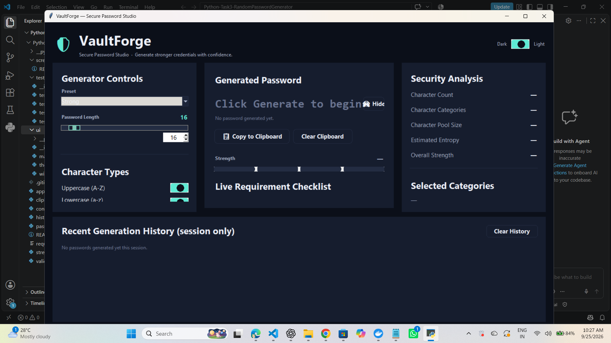

# 🔐 VaultForge

<p align="center">
  <b>Secure Random Password Generator &amp; Password Security Studio</b><br/>
  <i>Generate stronger credentials with confidence.</i>
</p>

<p align="center">
  
  
  
  
  
  
</p>

---
## Live Demo:
### https://vaultforge-z4h5.onrender.com/

## 📖 Project Overview

**VaultForge** is a premium, desktop password-generation studio built for
**OASIS INFOBYTE's Python Programming Internship — Task 3: Random Password
Generator**. It goes beyond the base task requirements to deliver a
polished, cybersecurity-product-style experience: a three-panel dashboard
with live strength analysis, a security checklist, session-only history,
clipboard protection, and a fully custom dark/light design system — all
built with nothing but the Python standard library plus `pyperclip`.

## 🎯 Why This Project?

Most "password generator" exercises stop at a command-line loop. VaultForge
treats the same underlying problem — generating unpredictable, rule-compliant
passwords — as a real product problem: how do you *show* someone their
password is strong, make it easy to use safely, and avoid ever putting the
user's secrets at risk (on disk, in logs, or sitting on the clipboard
forever)?

## ✨ Key Features

- 🎚 Password length from **8–128** characters via a slider *and* a spinbox
- ☑️ Toggle **uppercase, lowercase, numbers, and symbols** independently
- 🔒 Guarantees **at least one character from every selected type**
- 🧮 Uses Python's `secrets` module — **never** `random`
- 🚫 Optional **ambiguous character exclusion** (`0`, `O`, `1`, `l`, `I`, …)
- 📋 **Auto-copies** every generated password to the clipboard
- ⏱ Configurable **clipboard auto-clear** timer
- 📊 Live **strength meter** with an approximate **entropy estimate**
- 🕘 **Session-only** history of the last 5 generated passwords
- 🎨 Hand-designed **dark and light themes** — not a palette swap
- ⌨️ Keyboard shortcuts for common actions
- 🧯 Defensive error handling — the GUI never crashes on bad input

## 🛡 Advanced Security Features

| Feature | Detail |
|---|---|
| Cryptographic randomness | `secrets.choice()` for character selection, `secrets.SystemRandom().shuffle()` for shuffling |
| Guaranteed category coverage | One character from each *selected* category is always present |
| Ambiguous-character mode | Strips visually confusing characters from every pool independently, never emptying a category |
| Zero password logging | No `print()`, no debug logs, no analytics ever touch a generated password |
| Session-only history | History lives in a plain Python list; nothing is written to disk, ever |
| Clipboard hygiene | Auto-clear timer + manual "Clear Clipboard" button; clipboard contents are never logged |

## 🧠 Password Generation Logic

`password_generator.py` builds a password in three deterministic-but-secure
steps:

1. **Build category pools** — one string per *selected* character type
   (optionally stripped of ambiguous characters).
2. **Guarantee coverage** — pick one `secrets.choice()` character from each
   selected pool first, so every requirement is met regardless of length.
3. **Fill and shuffle** — fill the remaining length from the combined pool,
   then shuffle the whole list with `secrets.SystemRandom().shuffle()` so
   the guaranteed characters aren't predictably placed at the start.

This keeps the *logic* fully independent of Tkinter, so it can be
unit-tested (and reused) without ever opening a window.

## 📊 Strength Analysis

`strength_analyzer.py` estimates strength using the standard
`entropy = length × log2(pool size)` approximation, based on which
character categories actually appear in the password. Passwords are
classified as **Weak / Medium / Strong / Very Strong** against configurable
entropy thresholds, alongside honest, non-absolute security tips — the app
never claims to guarantee resistance to every possible attack.

## 📋 Clipboard Security

- Every generated password is copied to the clipboard automatically via
  `pyperclip`.
- A configurable timer (default **30 seconds**, adjustable from the UI)
  clears the clipboard automatically — but only if it still holds the
  password VaultForge copied, so it never wipes something else the user
  copied afterward.
- A manual **"Clear Clipboard"** button is always available.
- Clipboard contents are never logged or written anywhere.

## 🕘 Session History

- Keeps the **last 5** generated passwords, most recent first.
- Every entry is **masked by default**, with an individual **Show/Hide**
  toggle and a **Remove** button.
- A **"Clear History"** button wipes it instantly.
- History is a plain in-memory Python list — it is never persisted to a
  file, database, or any other store, and disappears completely on exit.

## 🖥 GUI / UX

VaultForge uses a three-column dashboard layout instead of a plain form:

- **Left panel** — branding, presets, length control, character-type
  toggles, and security options.
- **Center panel** — the hero password display, show/hide control, strength
  meter, and a live requirement checklist.
- **Right panel** — a security analysis breakdown (entropy, pool size,
  categories, tips).
- **Bottom panel** — session history.

All widgets beyond basic layout containers are custom-drawn on `Canvas`
(rounded cards, pill buttons, toggle switches, a segmented strength meter)
rather than default Tkinter widgets, with a deliberately distinct dark and
light theme.

## 🧰 Technology Stack

| Layer | Technology |
|---|---|
| Language | Python 3.10+ |
| GUI | Tkinter (`tkinter`, `tkinter.ttk`) |
| Randomness | `secrets` (standard library) |
| Clipboard | [`pyperclip`](https://pypi.org/project/pyperclip/) |
| Testing | `unittest` (standard library) |

## 🏗 Architecture

Business logic is fully separated from the UI so the core can be tested
without ever launching Tkinter:

```
Presets / Settings ──▶ validators.py ──▶ password_generator.py ──▶ strength_analyzer.py
                                                  │
                                                  ▼
                                          clipboard_manager.py
                                                  │
                                                  ▼
                                             history.py
                                                  │
                                                  ▼
                                         ui/main_window.py (Tkinter)
```

## 📁 Project Structure

```
Python-Task3-RandomPasswordGenerator/
├── app.py                       # Entry point
├── config.py                    # Character sets, presets, constants
├── password_generator.py        # Core secure generation logic
├── strength_analyzer.py         # Entropy & strength classification
├── validators.py                # Input validation (length, categories)
├── clipboard_manager.py         # pyperclip wrapper + auto-clear timer
├── history.py                   # Session-only password history
├── ui/
│   ├── __init__.py
│   ├── main_window.py           # Dashboard layout & wiring
│   ├── theme.py                 # Dark/light design tokens
│   └── widgets.py                # Custom canvas-based widgets
├── tests/
│   ├── test_password_generator.py
│   ├── test_strength_analyzer.py
│   ├── test_validators.py
│   └── test_history.py
├── screenshots/                 # App screenshots (see screenshots/README.md)
├── requirements.txt
├── .gitignore
└── README.md
```

## 🗂 File Overview

| File | Responsibility |
|---|---|
| `config.py` | Single source of truth for character sets, length limits, presets |
| `validators.py` | Pure validation functions, raise `ValidationError` with clear messages |
| `password_generator.py` | Builds pools, guarantees category coverage, generates + shuffles securely |
| `strength_analyzer.py` | Computes entropy, classifies strength, produces tips |
| `clipboard_manager.py` | Copies/clears clipboard, manages the auto-clear timer |
| `history.py` | In-memory, capped, non-persistent history of recent passwords |
| `ui/theme.py` | Color palettes, typography and spacing tokens for both themes |
| `ui/widgets.py` | Rounded `Card`, `PillButton`, `ToggleSwitch`, `StrengthMeter`, `Tooltip`, `RequirementRow` |
| `ui/main_window.py` | Assembles the dashboard and wires UI events to the logic layer |
| `app.py` | Creates the Tk root window and starts the app with top-level error handling |

## ✅ Validation & Error Handling

- Length is validated against an 8–128 range with clear messages.
- At least **two** character categories must be selected.
- All validation and generation errors are caught inside the GUI layer and
  shown as a status message *and* an error dialog — the application is
  designed to never crash from invalid input, a clipboard failure, or an
  unexpected generation error.

## 🔒 Security & Privacy Considerations

- **No logging of generated passwords** anywhere, at any log level.
- **No persistence** of passwords or history to disk, a database, or any
  browser-style storage.
- Clipboard auto-clear reduces the window a copied password sits exposed.
- Entropy figures and strength labels are estimates based on standard
  assumptions (uniform random selection from a known pool) — they are
  informational, not a guarantee against any specific attack.
- Python cannot guarantee secure memory wiping; when a password is cleared
  from the UI it is removed from visible state and application references
  as practically as possible, but this project makes no stronger claim
  than that.

## 🧪 Testing

45 automated tests cover the fully GUI-independent core logic:

| Test file | Coverage |
|---|---|
| `test_validators.py` | Length bounds, category-count rule, combined settings validation |
| `test_password_generator.py` | Exact length, per-category guarantees, ambiguous exclusion, uniqueness, invalid-input rejection |
| `test_strength_analyzer.py` | Entropy scaling with length/diversity, strength classification thresholds |
| `test_history.py` | Max-size cap, ordering, removal, clearing, masking, and **no files written to disk** |

Run them with:

```bash
python -m unittest discover -s tests -v
```

## 📸 Screenshots

### 01. Dashboard


### 02. Generated Password


### 03. Generator Controls


### 04. Generation History


### 05. Security Analysis


### 06. Dark Theme

## ▶️ How to Run

```bash
python app.py
```

## ⚙️ Installation

```bash
git clone https://github.com/shailajakunchala09/OIBSIP.git
cd OIBSIP/Python-Task3-RandomPasswordGenerator
python -m venv .venv
source .venv/bin/activate      # Windows: .venv\Scripts\activate
pip install -r requirements.txt
python app.py
```

> **Linux note:** Tkinter isn't installed via pip. If `import tkinter` fails,
> install it with your package manager, e.g. `sudo apt install python3-tk`.

## 🕹 Usage

1. Pick a **preset** (Quick Secure / Strong / Maximum Security) or customize
   settings manually.
2. Adjust **length** with the slider or spinbox.
3. Toggle the **character types** you want included.
4. Optionally enable **exclude ambiguous characters**.
5. Click **Generate Password** — it's copied to your clipboard automatically.
6. Review the **strength meter**, **entropy**, and **requirement checklist**.
7. Use **Regenerate**, **Copy**, **Show/Hide**, or browse **History** as needed.

## ⌨️ Keyboard Shortcuts

| Shortcut | Action |
|---|---|
| `Ctrl + Enter` | Generate a new password |
| `Ctrl + R` | Regenerate with current settings |
| `Ctrl + L` | Focus the length input |
| `Esc` | Clear the transient status message |

## 🚀 Future Enhancements

- Passphrase (word-based) generation mode
- Optional local, encrypted vault for saving named credentials
- Password strength comparison against known breach corpora (via a
  privacy-preserving API, never sending full passwords)
- Cross-platform packaged builds (PyInstaller)

## 🎓 Learning Outcomes

Building VaultForge reinforced:

- Why `secrets` (not `random`) is required for security-sensitive code
- How to separate business logic from UI for testability
- Practical entropy-based password strength estimation
- Building a custom, non-default Tkinter design system from primitives
- Safe clipboard handling patterns for sensitive data

## 👩‍💻 Developer

**Kunchala Shailaja**

Python Programming Internship — **OASIS INFOBYTE**
Task: **Task 3 – Random Password Generator**

## 📌 Project Status

✅ Complete — all OASIS INFOBYTE Task 3 Advanced requirements implemented
and verified by the automated test suite.
